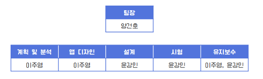
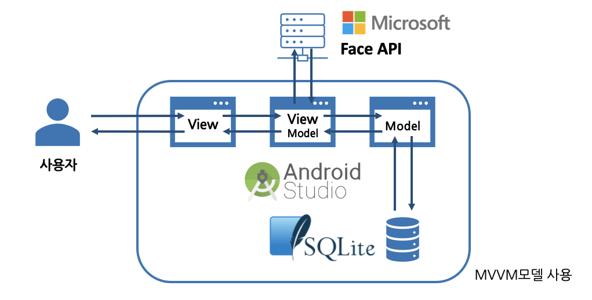

## 전남대학교 소프트웨어공합종합프로젝트(캡스톤) T-16

\-----------------------

### 감성분석과 기록을 포함한 심리 케어 어플리케이션 "하루지나"

- 팀원

  

\-----------------------

## 프로젝트 개요

COVID-19의 세계적 확산에 따른 사회적 거리두기가 이어졌고, 이는 곧 사람을 만날 수 없다는 상실감으로 인해 우울증 증가를 불러 일으켰다. 2021년 보건복지부의 21년 1분기 건강 실태조사 결과 발표에서도 확인할 수 있듯이, 우울 평균점수는 5.7점으로 2018년 평균점수인 2.3점에 비해 2배 이상 증가했다. 이러한 심적 어려움을 해소하기 위해 스스로 자신의 우울함을 인지하고 위로할 수 있는 수단이 필요함이 느껴졌고, 자가적인 심리 케어 어플 개발에 대한 동기를 가지게 되었다.

## 설계 아키텍처

## 제공되는 기능

1. 시간 설정

   하루마다 감정 분석 기능을 불러낼 시간을 정하고, 설정을 통해 재설정이 가능합니다

2. 감정 분석

   기기에 내장된 카메라를 이용해 얼굴 사진(selfie)을 찍고, Microsoft Face API를 통해 감정 분석을 제공해 드립니다

3. 상호 작용

   API를 통해 분석된 감정 결과와 최종 질의를 통해 오늘의 감정값을 확인해 드리며, 그에 맞는 상호작용을 제공해 드립니다

4. 감정 기록

   찍은 얼굴 사진(selfie)과 감정 분석값을 볼 수 있습니다. 사용자분들은 매일매일 자신이 어떤 기분이였는지 확인할 수 있습니다

\-----------------------

### 프로젝트 TOOL

- Android Studio
- Java
- draw.io
- proto.io
- SQLite
- ProjectLibre
